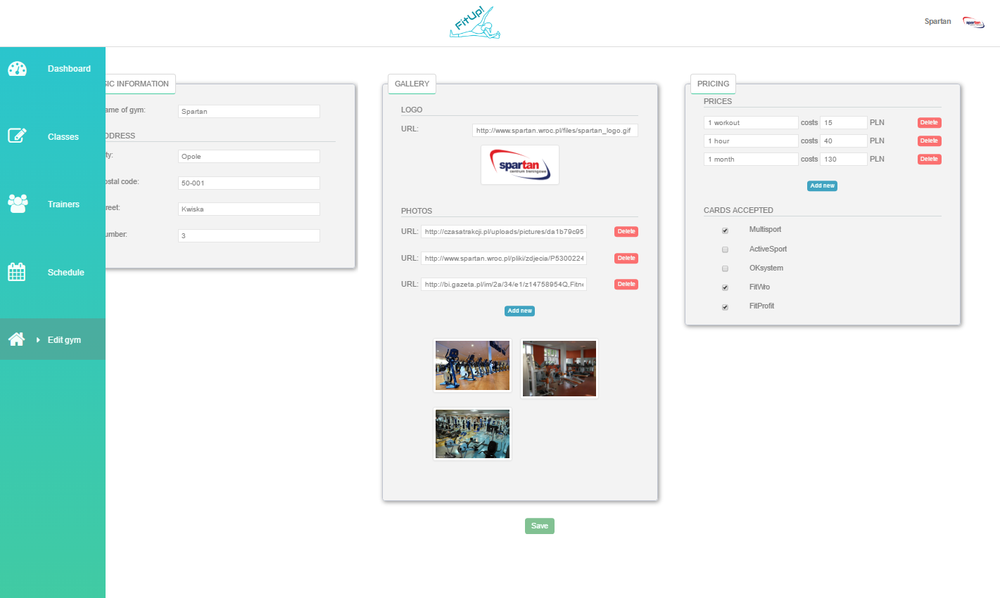

# FitUp! - fitness classes manager

Fitup is a web system that consists of:

1. Admin application for gyms or other entities that organize fitness classes. It enables them to manage trainers, types of fitness 
classes, schedule of classes as well as information about themselves (e.g. gallery, logo, prices, sport cards accepted, address).
2. Front application for people who attend fitness classes. It includes schedule of all fitness classes in the given location and 
possibility to filter them by trainer, gym or type of classes. Users can browse gyms or trainers separately as well. Additionally, 
there is Body Mass Index calculator.
3. Backend for both parts


## Getting Started

For admin part authorization is required.

To run the admin app you should:

1. ```cd FitApp```
2. Run ```npm i```
3. Run ```gulp serve```
4. Open your browser on: ```http://localhost:9000/```.

You should see:




To run the front app you should:

1. ```cd FitUp-front```
2. Run ```npm i```
3. Run ```npm start```
4. Open your browser on: ```http://localhost:3000/```.


You should see:


Both apps currently use backend which is deployed on Heroku so no need to run local server for backend.


## Built With

Admin app:
Angular 2, Gulp, autoprefixer, Webpack, Lodash, Babel + ES2015, UI Kit, SCSS

Front-app:
React, storybook, React refetch + axios, SCSS, UIKit, dhtmlx_scheduler, Lodash, Webpack, Babel + ES2015

Backend:
NodeJS, Express, MongoJS, MongoDB + mLab, Babel + ES2015, JSON Web Tokens


## Authors

* Dominik Broj
